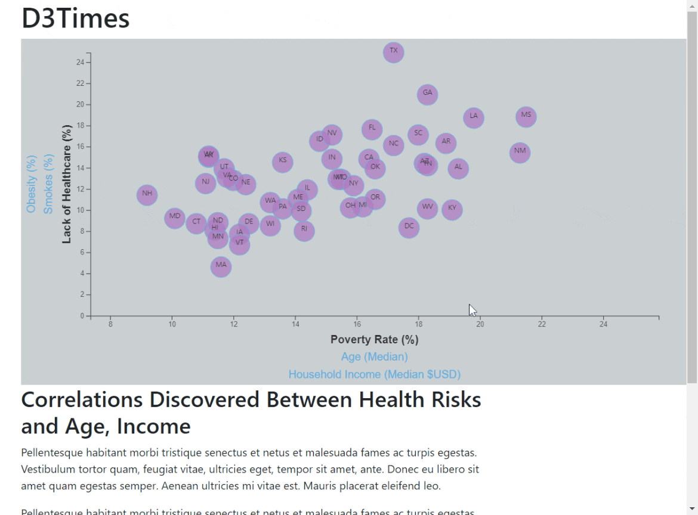

# D3-Challenge (Dynamic Graphics with D3)

---
Background & Challenge

Welcome to the newsroom! You've just accepted a data visualization position for a major metro paper. You're tasked with analyzing the current trends shaping people's lives, as well as creating charts, graphs, and interactive elements to help readers understand your findings.

The editor wants to run a series of feature stories about the health risks facing particular demographics. She's counting on you to sniff out the first story idea by sifting through information from the U.S. Census Bureau and the Behavioral Risk Factor Surveillance System.

The data set included with the assignment is based on 2014 ACS 1-year estimates from the US Census Bureau. The current data set includes data on rates of income, obesity, poverty, etc. by state. MOE stands for "margin of error."

Create a scatter plot that represents each state with circle elements. Place additional labels in your scatter plot and give them click events so that your users can decide which data to display. Animate the transitions for your circles' locations as well as the range of your axes. Add tooltips to your circles and display each tooltip with the data that the user has selected.

---
Graphic Application Dev Toolkit

>* JavaScript
>* d3.js
>* d3-tip.js
>* GitBash
>* HTML
>* CSS
>* CSV Backend
>* [Gif Generator](https://gifcap.dev/)
---
Operating Instructions

1. Clone repository to desired location while maintaining directory paths. 

2. **Local Server** *Recommended* : Open reposity with VS Code, and initialize a local server from the index.html file using the [LiveServer](https://marketplace.visualstudio.com/items?itemName=ritwickdey.LiveServer) extension.

3. **Local Server** *Python* : Open GitBash from cloned repository directory location and enter the following to initialize a local server:

>`python -m http.server`

4. **Local Server** *Python* : Using your browser, navigate to the initialized server at **localhost:8000**, and this will serve the application without CORS issues.
---
Dynamic Graphic Screenshot

